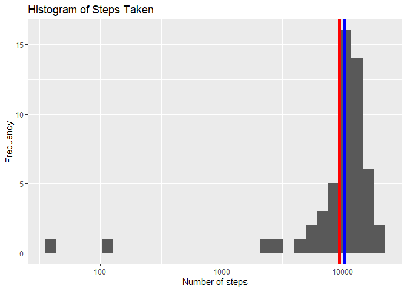
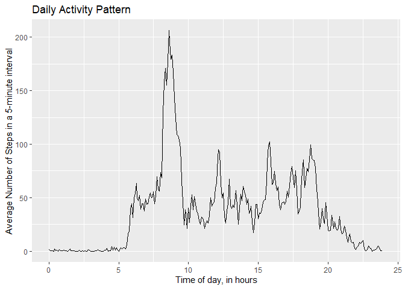
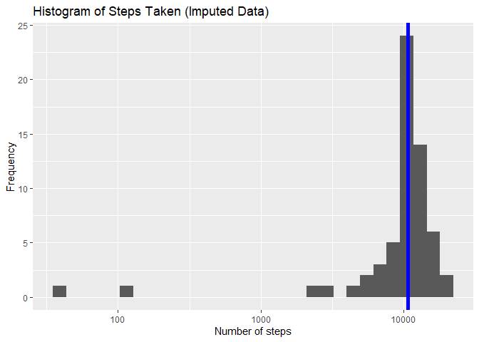
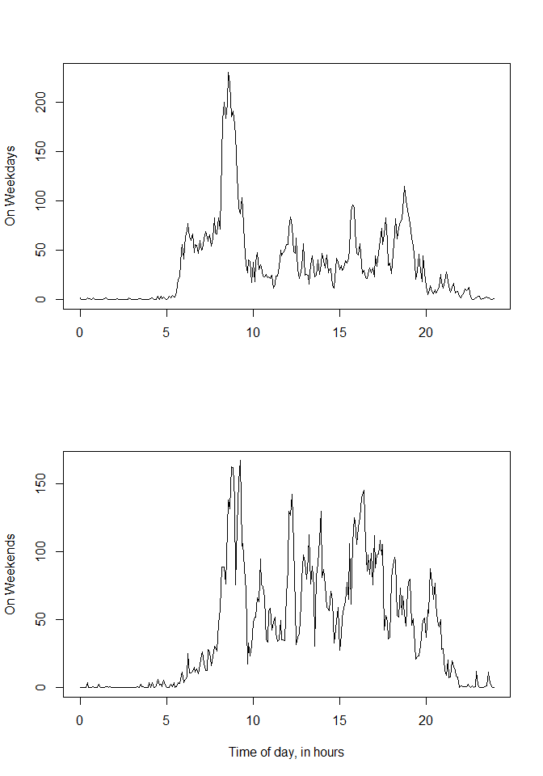

## Loading libraries

```r
library(dplyr)
```

```
## 
## Attaching package: 'dplyr'
```

```
## The following objects are masked from 'package:stats':
## 
##     filter, lag
```

```
## The following objects are masked from 'package:base':
## 
##     intersect, setdiff, setequal, union
```

```r
library(ggplot2)
library(lattice)
```


## Loading and preprocessing the data
#### Reading data

```r
if(!file.exists("activity.csv")) {
        unzip("activity.zip")
}

data <- read.csv("activity.csv", header=TRUE,
                 colClasses=c("integer", "Date", "integer"))
```

#### Defining some useful functions

```r
# converting intervals to decimal notation and vice versa
totime <- function(numChar) {
        num <- as.numeric(numChar)
        hour <- floor(num / 100)
        min_decimal <- (num - hour * 100) / 60
        hour + min_decimal
}
tochar <- function(decimalTime) {
        hour <- floor(decimalTime)
        minutes <- round((decimalTime - hour) * 60, digits=0)
        paste(as.character(hour), as.character(minutes), sep=":")
}
```

#### Processing the data

```r
data_day <- data %>%
                group_by(date) %>%
                summarise(dailyCount=sum(steps, na.rm=TRUE))
data_interval <- data %>%
                group_by(interval) %>%
                summarise(intervalCount=mean(steps, na.rm=TRUE))
data_interval$interval <- totime(data_interval$interval)
```


## What is mean total number of steps taken per day?

Here's a histogram of the data.

```r
# calculating the mean and median
mean.day <- mean(data_day$dailyCount)
median.day <- median(data_day$dailyCount)

g <- ggplot(data_day, aes(x=dailyCount))
g +
        geom_histogram() +
        scale_x_log10() +
        geom_vline(xintercept=mean.day, size=2, color="red") +
        geom_vline(xintercept=median.day, size=2, color="blue") +
        xlab("Number of steps") +
        ylab("Frequency") +
        labs(title="Histogram of Steps Taken")
```

```
## Warning: Transformation introduced infinite values in continuous x-axis
```

```
## `stat_bin()` using `bins = 30`. Pick better value with `binwidth`.
```

```
## Warning: Removed 8 rows containing non-finite values (stat_bin).
```

<!-- -->

In the above plot, the mean of the number of steps taken is 9354.2295082 shown in **red** and the median of the number of steps taken is 10395 shown in **blue**.


## What is the average daily activity pattern?

```r
g <- ggplot(data_interval, aes(x=interval, y=intervalCount))
g +
        geom_line() +
        xlim(0, 24) +
        xlab("Time of day, in hours") +
        ylab("Average Number of Steps in a 5-minute interval") +
        labs(title="Daily Activity Pattern")
```

<!-- -->

```r
max_interval <- data_interval[which.max(data_interval$intervalCount), ]
max_interval[1] <- tochar(max_interval[1])
```

The interval with the maximum number of steps on average is the five minute interval starting at 8:35 AM with 206.1698113 steps.


## Imputing missing values

```r
NACount <- sum(is.na(data$steps))
fraction <- NACount / dim(data)[1]

# reprocessing the data, this time imputing the missing values
impData <- data
for(i in which(is.na(impData$steps))) {
        interval <- totime(impData$interval[i])
        impData$steps[i] <- data_interval$intervalCount[data_interval$interval==interval]
}
```

There are a total of 2304 missing values in the dataset, which represent 0.1311475 of the total.

The data is imputed by replacing the missing value with the mean number of steps in that interval. The new data set is called *impData*.

Below is a histogram similar to what we saw before.

```r
impData_day <- impData %>%
                group_by(date) %>%
                summarise(dailyCount=sum(steps, na.rm=TRUE))

mean.impDay <- mean(impData_day$dailyCount)
median.impDay <- median(impData_day$dailyCount)
impDayStats <- round(c(mean.impDay, median.impDay), 0)

g <- ggplot(impData_day, aes(x=dailyCount))
g +
        geom_histogram() +
        scale_x_log10() +
        geom_vline(xintercept=mean.impDay, size=2, color="red") +
        geom_vline(xintercept=median.impDay, size=2, color="blue") +
        xlab("Number of steps") +
        ylab("Frequency") +
        labs(title="Histogram of Steps Taken (Imputed Data)")
```

```
## `stat_bin()` using `bins = 30`. Pick better value with `binwidth`.
```

<!-- -->

In the above plot, the mean of the number of steps taken is 10766 shown in **red** and the median of the number of steps taken is 1.0766\times 10^{4} shown in **blue**.


## Are there differences in activity patterns between weekdays and weekends?

```r
weekends <- c("Saturday", "Sunday")
isWeekday <- as.factor(!weekdays(impData$date) %in% weekends)
impData$isWeekday <- isWeekday

# subsetting data
impDataWeekday <- impData[impData$isWeekday==TRUE, ]
impDataWeekend <- impData[impData$isWeekday==FALSE, ]

# processing data
weekday_interval <- impDataWeekday %>%
                group_by(interval) %>%
                summarise(intervalCount=mean(steps, na.rm=TRUE))
weekday_interval$interval <- totime(weekday_interval$interval)

weekend_interval <- impDataWeekend %>%
                group_by(interval) %>%
                summarise(intervalCount=mean(steps, na.rm=TRUE))
weekend_interval$interval <- totime(weekend_interval$interval)

# plotting
par(mfrow=c(2, 1))
with(weekday_interval, plot(interval, intervalCount, type="l", xlab="",
                            ylab="On Weekdays"), lwd=3)

with(weekend_interval, plot(interval, intervalCount, type="l", xlab="Time of day, in hours",
                            ylab="On Weekends"), lwd=3)
```

<!-- -->
